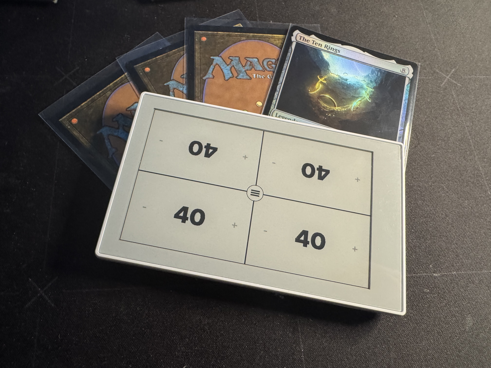
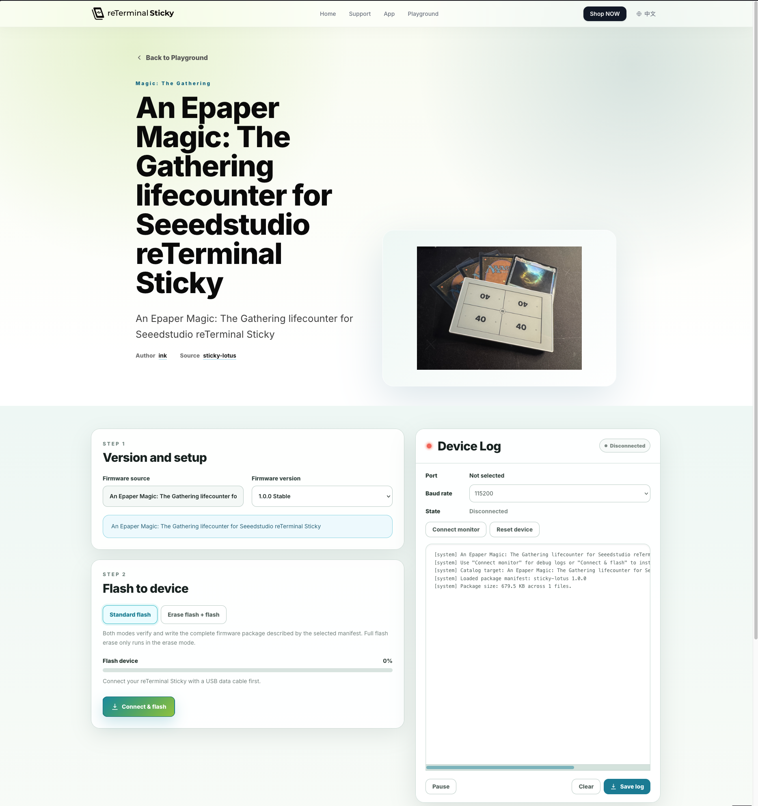
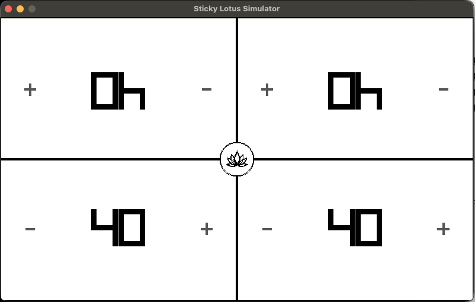

# Sticky Lotus

> A Magic: The Gathering life counter built for the Seeed Studio reTerminalSticky.

<p align="center">
  
</p>


<p align="center">
  Video preview:   https://lotus.cooppunks.social/sticky-lotus.webm
</p>

<p align="center">
  A fast, touch-first life counter for Magic: The Gathering — designed specifically
  for the E-Ink display of the Seeed Studio Sticky.
</p>
---

## About Sticky Lotus

**Sticky Lotus** turns the Seeed Studio Sticky into a dedicated tabletop companion
for Magic: The Gathering.

The project focuses on the things you actually need during a game:

- Life tracking for 2 or 4 players
- Commander Damage
- Poison Counters
- Touch gestures
- Long-press ±10 life changes
- Configurable starting life
- Battery status
- Persistent game state
- Deep Sleep support
- E-Ink optimized partial refreshes

The goal is a device that feels less like an embedded development board
and more like a purpose-built Magic accessory.

## Flashing directly via seeedstudio playground website
<p align="center">
  
</p>

Visit https://www.seeedstudio.com/sticky/playground/sticky-lotus/


---

## Hardware

Sticky Lotus is designed for the **Seeed Studio Sticky**.

[Seeed Studio Sticky](https://www.seeedstudio.com/reTerminal-Sticky-p-6861.html?sensecap_affiliate=eNnegDW&referring_service=link)*

It's a 50$ device and combines an ESP32-S3, touch input and an E-Ink display,
making it particularly well suited for a Magic: The Gathering life counter:
the display remains readable without a backlight and even keeps its
last image while the device is sleeping.
*affiliate link

## Features

### Life Counter

Sticky Lotus supports both:

**2 Player**

and

**4 Player / Commander**

Each player receives an independent life counter with touch controls.

Tap the `+` or `−` area to change life by one.

Hold the area to change life by ten.

### Commander Damage

**Swipe left or right** from a player area to open the Commander Damage interface.

Commander damage can be edited independently for each attacking player
and is applied when leaving the Commander Damage screen.

### Poison Counters

Poison counters are available directly through a **swipe up** gesture from
the corresponding player area and **swipe down** to close. 

### Touch optimized

The interface is designed around the physical orientation of players
around a table.

Player areas facing the opposite side are rotated automatically so that
every player can read and operate their own controls.

### E-Ink optimized rendering

Instead of refreshing the entire screen after every input, Sticky Lotus
updates only the affected regions whenever possible.

This significantly improves perceived responsiveness and reduces
unnecessary E-Ink refreshes.

---

## Deep Sleep

Pressing the hardware power button puts Sticky Lotus into Deep Sleep.

Before sleeping:

1. The current game state is stored in NVS.
2. The Deep Sleep artwork is rendered.
3. The E-Ink display performs its final refresh.
4. The ESP32 enters Deep Sleep.

The E-Ink panel retains the sleep artwork without requiring continuous power.

Press the power button again to wake the device and restore the previous game.

---

## Simulator


Sticky Lotus can also be developed and tested locally using the simulator, without flashing the firmware to a physical Sticky device. The simulator runs the same core application and UI code, making it useful for quickly testing layouts, interactions, and game logic.
<p align="center">
  
</p>

If the required development tools such as CMake, Ninja, and a C++ compiler are already installed on your system, Nix is not required. From the project root, configure, build, and start the simulator with:
```bash
cmake -S . -B build -G Ninja
cmake --build build
./build/simulator/sticky-lotus-simulator
```
After making code changes, you normally only need to rebuild and restart:
```bash
cmake --build build
./build/simulator/sticky-lotus-simulator
```

nix develop is therefore just a convenient way to provide a reproducible development environment; it is not required to run the simulator if the necessary dependencies are installed locally.
```bash
nix develop //if you are using nix

cmake -S . -B build -G Ninja
cmake --build build
./build/simulator/sticky-lotus-simulator
```

# Flash release from this repo 

Only if you will not use the released on https://www.seeedstudio.com/sticky/playground/sticky-lotus/


On the official firmware upload page, under Step 1: Firmware Source, select Manual Upload and choose the file available under Releases. 
- https://www.seeedstudio.com/sticky/playground/official-firmware/
- https://github.com/inkOne/sticky-lotus/tree/main/firmware/release

Then, under Step 2: Connect and Flash, click the button to upload or flash Sticky Lotus to your Sticky.

## Firmware

The firmware is built from the firmware directory using ESP-IDF. The project currently targets the ESP32-S3 and is built with ESP-IDF 5.5.4. idf.py build compiles the application together with all ESP-IDF components and generates the bootloader, partition table, and application binaries. 

```bash
nix develop  //if you are using nix
idf.py build
idf.py -p PORT flash 
```

Without Nix, a working ESP-IDF development environment must be installed first. This includes ESP-IDF itself, its Python environment and packages, the ESP32-S3 cross-compiler/toolchain, CMake, Ninja, Git, and the other tools installed by the ESP-IDF setup scripts. Espressif recommends installing ESP-IDF and then activating its environment before building.

```bash
source ~/esp/esp-idf/export.sh
cd firmware
idf.py build
```

The exact path to export.sh depends on where ESP-IDF was installed.

A successful build produces the firmware artifacts under:

```bash
firmware/build/
```

ESP-IDF also generates the flash configuration containing the correct offsets for these binaries. The binaries and offsets should be taken from the actual build rather than hard-coded.  

To build and flash directly to a connected Sticky:

```bash
cd firmware
idf.py build
idf.py -p <PORT> flash monitor
```

## Upstream Firmware & Credits

Sticky Lotus was not developed completely from scratch.

A major source of inspiration and an invaluable reference during development was the [folloup-sticky project](https://github.com/alxv2016/folloup-sticky) by alxv2016.

I am incredibly grateful for the work that went into this project. It already demonstrated and implemented many of the fundamental building blocks needed to develop applications for the Seeed Studio Sticky — at a time when official documentation and source code for the device were not yet publicly available.

Being able to study a working implementation of the hardware integration made it significantly easier to understand the display, touch input, power management, battery handling, and other parts of the Sticky platform.

Thank you for making this work publicly available and giving others a foundation to learn from and build upon.

Sticky Lotus uses these insights as a starting point while implementing its own application architecture, user interface, game logic, and Magic: The Gathering–focused experience.
---
